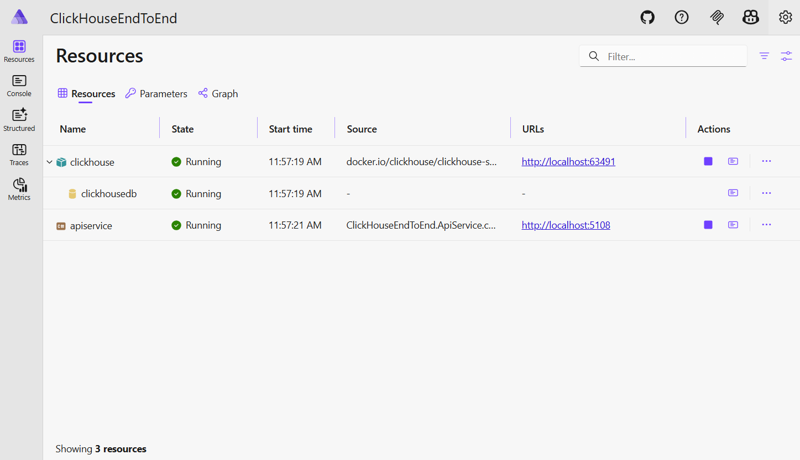
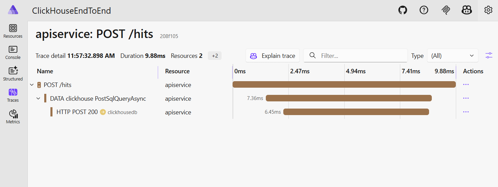
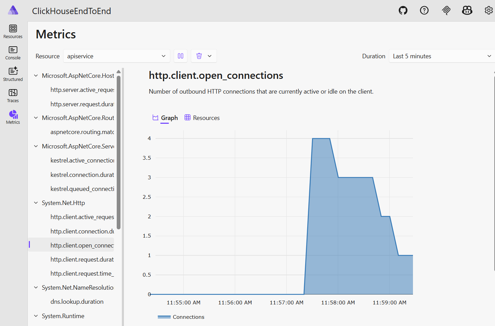

# ClickHouse.Aspire

.NET Aspire integration for [ClickHouse](https://clickhouse.com/) using [ClickHouse.Driver](https://github.com/clickhouse/clickhouse-cs). Provides container orchestration, health checks, OpenTelemetry tracing, and dependency injection for ClickHouse in Aspire applications.

## Packages

| Package | Description |
|---------|-------------|
| `Aspire.Hosting.ClickHouse` | Hosting integration for the AppHost — adds ClickHouse containers, databases, volumes |
| `Aspire.ClickHouse.Driver` | Client integration for services — registers `ClickHouseDataSource` with health checks, tracing, and configuration binding |

## Getting started

### AppHost (orchestration)

Add a ClickHouse server and database to your AppHost:

```csharp
var builder = DistributedApplication.CreateBuilder(args);

var clickhouse = builder.AddClickHouse("clickhouse")
                        .WithDataVolume();

var db = clickhouse.AddDatabase("clickhousedb");

builder.AddProject<Projects.MyApi>("api")
       .WithReference(db)
       .WaitFor(db);

builder.Build().Run();
```

This will:
- Pull and run the `clickhouse/clickhouse-server` container image
- Generate a secure password automatically (or use a custom one via the `password` parameter)
- Create the `clickhousedb` database on startup
- Inject the connection string into your service via `ConnectionStrings:clickhousedb`
- Wait for the container to be healthy before starting dependent services

#### Custom credentials

```csharp
var username = builder.AddParameter("clickhouse-user");
var password = builder.AddParameter("clickhouse-pass", secret: true);

var clickhouse = builder.AddClickHouse("clickhouse", userName: username, password: password);
```

#### Data persistence

```csharp
// Named volume (persists across container restarts)
clickhouse.WithDataVolume();

// Or bind mount to a host directory
clickhouse.WithDataBindMount("./data/clickhouse");
```

### Service project (client)

Register `ClickHouseDataSource` in your service:

```csharp
var builder = WebApplication.CreateBuilder(args);

builder.AddClickHouseDataSource("clickhousedb");
```

Then inject it via DI:

```csharp
app.MapGet("/data", async (ClickHouseDataSource dataSource) =>
{
    await using var connection = dataSource.CreateConnection();
    await connection.OpenAsync();

    await using var command = connection.CreateCommand();
    command.CommandText = "SELECT count() FROM my_table";
    var result = await command.ExecuteScalarAsync();
    return Results.Ok(result);
});
```

#### Keyed services

Register multiple ClickHouse instances:

```csharp
builder.AddKeyedClickHouseDataSource("analytics");
builder.AddKeyedClickHouseDataSource("events");
```

#### Configuration

Settings can be provided in `appsettings.json`:

```json
{
  "Aspire": {
    "ClickHouse": {
      "Driver": {
        "DisableHealthChecks": false,
        "DisableTracing": false,
        "HealthCheckTimeout": "00:00:05"
      }
    }
  }
}
```

Or via the `configureSettings` delegate:

```csharp
builder.AddClickHouseDataSource("clickhousedb", configureSettings: settings =>
{
    settings.DisableHealthChecks = true;
});
```

## Features

- **Container lifecycle management** via .NET Aspire orchestration
- **Automatic database creation** on container startup using `AddDatabase()`
- **Health checks** — HTTP ping on the hosting side, `PingAsync()` on the client side
- **OpenTelemetry tracing** via the `ClickHouse.Driver` activity source
- **Configuration binding** from `appsettings.json` and connection strings
- **Secure credential management** with auto-generated passwords and Aspire parameter support
- **Data persistence** via named volumes or bind mounts

## Example project

The `examples/ClickHouseEndToEnd` directory contains a full working example with an AppHost and an API service that demonstrates creating tables, inserting data, and querying ClickHouse.

### Running the example

```
cd examples/ClickHouseEndToEnd/ClickHouseEndToEnd.AppHost
dotnet run
```

This starts the Aspire dashboard, a ClickHouse container, and the API service. The dashboard shows all three resources running, and can be used to examine service health status, console output, structured logs, traces, and metrics.



The API service exposes three endpoints:

- `POST /init` — creates the `hits` table
- `POST /hits` — records a hit (`{"url": "https://example.com"}`)
- `GET /hits` — returns all recorded hits

Distributed traces show the full request lifecycle from the API service through to ClickHouse:



The Aspire metrics view provides runtime observability for the service:



## License

MIT
